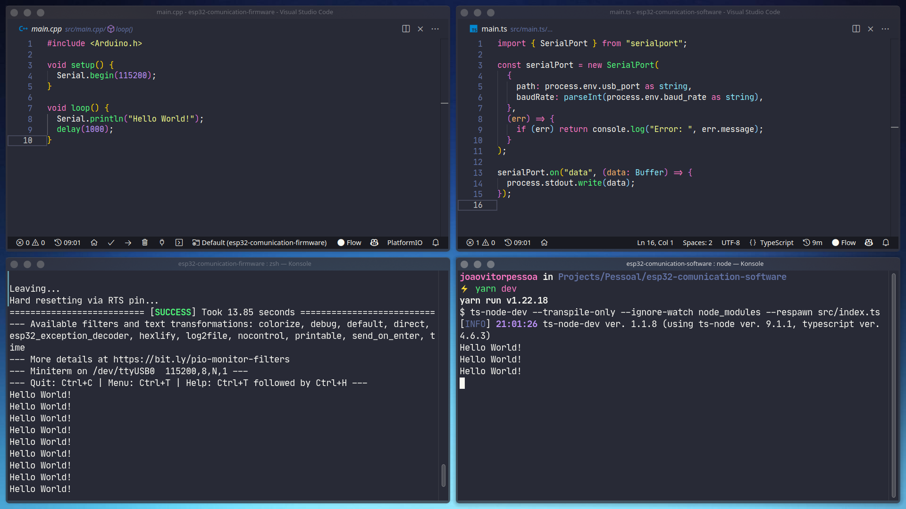

## Development

How to push the firmware to the device and start serial monitor:

```bash
sudo chown joaovitorpessoa /dev/ttyUSB0 && \
  pio run --target upload && \
  pio device monitor
```

How to run the software (stop the serial monitor before):

```bash
yarn && \
  yarn dev
```

